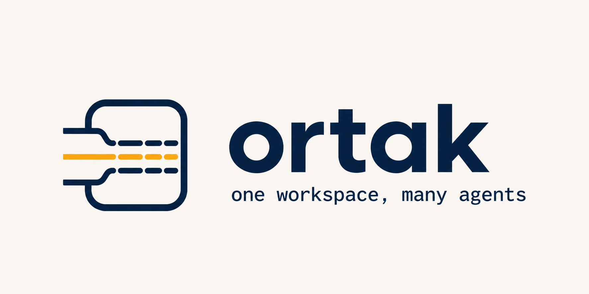

<p align="center">
  
</p>

ortak lets coding agents and people work in the same live directory without separate branches or worktrees. It records each edit and creates task branches when the work ends.

## How it works

1. Everyone edits the same workspace and uses the same running system.
2. ortak records each edit with its session, file, and changed lines.
3. The gate prevents sessions from editing the same active region. Reported errors stop edits until the assigned session fixes them.
4. `ortak publish` creates a clean branch from one session's recorded changes.

## Install

```bash
curl --proto '=https' --tlsv1.2 -fsSL https://raw.githubusercontent.com/yibudak/ortak/main/install.sh | sh
```

The installer verifies the release checksum and writes the binary to `~/.local/bin`. Set `ORTAK_INSTALL_DIR` to use another directory or `ORTAK_VERSION` to pin a release.

To build from source instead:

```bash
cargo install --git https://github.com/yibudak/ortak --locked
```

Initialize ortak inside your project and start the daemon:

```bash
cd /path/to/your-project
ortak init
ortak daemon
```

For Claude Code, install the plugin from this repository:

```bash
claude plugin marketplace add yibudak/ortak
claude plugin install ortak@ortak
```

For Codex, add this repository as a marketplace and install the plugin:

```bash
codex plugin marketplace add yibudak/ortak
codex plugin add ortak@ortak
```

When working on ortak itself, point the marketplace at a clone instead so the
plugin reflects local changes:

```bash
claude plugin marketplace add /path/to/your/ortak/clone
```

Switch back to the published plugin with `claude plugin marketplace remove ortak`
followed by the `add` command above.

## Working alongside other sessions

ortak journals and gates file edits. It does not touch Git, and Git is the one
place it cannot protect you: `git stash`, `checkout`, `switch`, `branch`,
`commit` and `add` all act on the whole tree, including the uncommitted work of
every other session in it. A stash takes their changes with yours; a commit
ships files you never looked at. Leave those commands alone while other sessions
are working and let `ortak publish` build the branch from your own journal
instead. `git diff`, `git log` and `git status` change nothing, so use them
freely.

The SessionStart context states this rule and the plugin's skill expands on it,
but neither is enforced. If you want it to hold every time, put it in your
project's own `CLAUDE.md` or `AGENTS.md`, where the agent reads it on every turn
instead of once at startup.

A session that was already running when you installed the plugin does not have
the hooks, because a harness reads them at session start. That session never
registers, everything it writes lands on `human` in the journal, and
`ortak publish` has no branch to build for it. Restart or resume it to pick the
hooks up.

## Use

```bash
ortak status
ortak log
ortak intent ortak-2 "Implement the login page"
ortak report ortak-2 --command "pytest" "relevant error output"
ortak resolved ortak-2
ortak publish ortak-2 --push
```

Publishing requires a Git repository with at least one commit and a configured remote.
